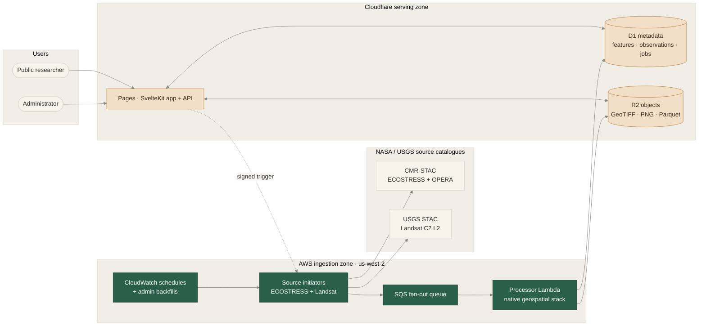

  
Final Year Project · G53IDS · University of Nottingham

  <h1 class="cover-title">Satellite Water Temperature Monitoring</h1>
  

  
Transforming a fragile proof-of-concept into an automated, multi-sensor research-support platform

  

    Maksim Skobun
    ·
    May 2026
    ·
    Supervisor: Dr Tomas Maul
  

---
title: Why this matters
---

<h2 class="slide-title">Why this matters</h2>

  

    
Research need

    
Surface-water temperature helps researchers reason about ecological stress, habitat shifts, water quality, and climate-related change in lakes and rivers.

  

  

    
01

    <h3>Satellite data is abundant</h3>
    
ECOSTRESS and Landsat already observe monitored reservoirs, but raw products are hard to use without geospatial tooling.

  

  

    
02

    <h3>Researchers need access</h3>
    
A web platform lets non-specialists browse, inspect, export, and share observations without downloading source rasters.

  

  

    
03

    <h3>Interpretation needs caution</h3>
    
Cloud, land-water mixing, missing coverage, and unvalidated retrievals must stay visible in the final interface.

  

---
title: The legacy system could not continue unchanged
---

<h2 class="slide-title">The legacy system could not continue unchanged</h2>

  

    
01

    

      
$30 / month fixed cost

      
Heroku Eco dyno plus Supabase Pro created a recurring cost even when the research platform was idle.

    

  

  

    
02

    

      
Manual AppEEARS retrieval

      
Routine updates required a developer to edit script parameters, submit orders, poll for completion, and run processing locally.

    

  

  

    
03

    

      
ECOSTRESS-only coverage

      
The ISS orbit gives useful high-resolution observations, but irregular revisit times leave unpredictable gaps for trend analysis.

    

  

  

    
04

    

      
Limited exploration and reproducibility

      
Users could not inspect point history or filter pixels interactively, and new maintainers could not rebuild the cloud environment from source.

    

  

---
title: Goals and scope
---

<h2 class="slide-title">Goals and scope</h2>

  

    
O1

    
Optimise storage and retrieval

    
R2 + D1 + Parquet

  

  

    
O2

    
Improve water-mask verification

    
OPERA DSWx-HLS for Landsat

  

  

    
O3

    
Add richer public visualisation

    
Hover, thresholds, point history

  

  

    
O4

    
Integrate multiple satellite sources

    
ECOSTRESS + Landsat 8/9

  

  

    
O5

    
Zone differentiation

    
Removed from scope

  

  

    
O6

    
Make the platform maintainable after handover

    
Terraform, CI/CD, docs, tests

  

---
title: Remote-sensing constraints
---

<h2 class="slide-title">Remote-sensing constraints</h2>

  

    
Selected

    
ECOSTRESS

    
70 m

    
ISS orbit · irregular local times

    
High spatial detail for small reservoirs, but revisit timing is unpredictable and gaps are common.

  

  

  

    
Selected

    
Landsat 8/9

    
30 m

    
16-day repeat · offset satellites

    
Predictable long-term record and OPERA water-mask option, but still affected by cloud and missing coverage.

  

  

  

    
Rejected

    
MODIS

    
1 km

    
Daily · Terra + Aqua

    
Daily coverage is attractive, but the pixels are too coarse for many target reservoirs.

  

---
title: Architecture
background: '#141413'
---

  
01

  <h2 class="section-title">Architecture and implementation</h2>

---
title: Multi-cloud architecture
---

<h2 class="slide-title">Multi-cloud architecture</h2>

---
title: Why this architecture works
---

<h2 class="slide-title">Why this architecture works</h2>

  

    
01

    

      
Process beside the source data

      
ECOSTRESS, Landsat, and OPERA COG assets are hosted in AWS <strong>us-west-2</strong>. Running Lambda there avoids source-data egress and keeps range-read latency low.

    

  

  

    
02

    

      
Fan out only when work exists

      
SQS turns each missing scene into an independent message. Lambda scales for scheduled ingestion and backfills, then returns to zero idle compute cost.

    

  

  

    
03

    

      
Serve cheaply from Cloudflare

      
Pages, D1, and R2 keep the public app, metadata, and derived artefacts close together while staying inside free-tier limits for steady-state use.

    

  

  

    
04

    

      
Move analysis to the browser

      
Parquet plus DuckDB-WASM supports point history and CSV export without a server-side time-series API or duplicate CSV archive.

    

  

---
title: Data products and browser analysis
---

<h2 class="slide-title">Data products and browser analysis</h2>

  

    
The archive is designed for both users and researchers

    
Each successful observation is stored once, then reused across the public map, downloads, dashboards, point history, and external analysis workflows.

  

  

    
GeoTIFF

    
Highest-fidelity processed raster for GIS inspection and reproducible export.

  

  

    
PNG

    
Fast preview layer so users see the observation before analytical data finishes loading.

  

  

    
Parquet

    
Year-sharded columnar archive queried in the browser by DuckDB-WASM and exported as CSV on demand.

  

  

    
deck.gl

    
Client-side pixel rendering, hover inspection, threshold filtering, palette changes, and map picking.

  

---
title: Quality and transparency
---

<h2 class="slide-title">Quality and transparency</h2>

  

    
The system is intentionally conservative: accepting a cloudy, land, or invalid pixel as water temperature is worse than showing an explicit gap.

    

      

        
11.4%

        
ECOSTRESS pixels accepted

      

      

        
9.5%

        
Landsat pixels accepted

      

      

        
3.5B

        
raw pixels summarised across production scenes

      

      

        
5×5

        
local spatial check for isolated artefacts

      

    

  

  

    
Audit trail, not decoration

    

      
Cloud or shadow
Observation exists, but the value should not be trusted.

      
Land or shoreline mixture
The pixel is not a clean water-surface measurement.

      
No-data or missing coverage
The satellite did not provide a valid measurement for that location.

      
Implausible or isolated outlier
Physical range and local checks remove obvious artefacts.

    

  

---
title: Public and admin experience
---

<h2 class="slide-title">Public and admin experience</h2>

  

    <h3 class="col-heading">Public research workflows</h3>
    <ul class="conclusion-list">
      <li>Browse monitored water bodies on an interactive satellite map</li>
      <li>Switch ECOSTRESS and Landsat observations by date and source</li>
      <li>Inspect per-pixel values, threshold ranges, and point history</li>
      <li>Download GeoTIFF, Parquet, and on-demand CSV exports</li>
      <li>Use responsive map, drawer, and point-history layouts on mobile</li>
    </ul>
  

  

    <h3 class="col-heading">Operator workflows</h3>
    <ul class="conclusion-list">
      <li>Authenticate through Cognito-backed admin routes</li>
      <li>Monitor jobs, requests, feature freshness, and thumbnails</li>
      <li>Inspect rejection summaries without opening cloud consoles</li>
      <li>Run manual historical backfills from the web interface</li>
      <li>Configure catch-up behaviour and Landsat water-mask mode</li>
    </ul>
  

---
title: "Live demo: Banglang Reservoir"
background: '#141413'
---

  
Live demo route

  <h2 class="demo-title">Banglang Reservoir</h2>
  

    Open public map
    Select feature
    Switch ECOSTRESS / Landsat
    Inspect pixel
    Threshold + palette
    Point history
    Archive downloads
    Public dashboard
    Admin backfill
    Jobs + diagnostics
  

---
title: Evaluation
background: '#141413'
---

  
02

  <h2 class="section-title">Evaluation and handover</h2>

---
title: Operational evaluation
---

<h2 class="slide-title">Operational evaluation</h2>

  

    

    
$0.03

    
steady-state monthly cost

    
Down from $30/month; Cloudflare remains inside free-tier usage; ECR image storage is the only recurring charge.

  

  

    

    
10,881

    
processed production scenes

    
3,341 ECOSTRESS + 7,540 Landsat; Landsat adds 2.3× scene volume and a predictable repeat cycle.

  

  

    

    
~5 min

    
monthly ECOSTRESS run

    
Direct STAC/COG access and SQS fan-out replace an hours-to-days AppEEARS order-and-poll workflow.

  

  

    

    
3.9 GB

    
R2 storage after cleanup

    
39% of the 10 GB free tier; projected growth remains within free tier for around 21 months.

  

---
title: User survey results
---

<h2 class="slide-title">User survey results</h2>

  

    
Task-based usability survey

    
25

    
University of Nottingham Malaysia students used the live deployment to browse the map, select a water body, switch sources, inspect pixels, open point history, and adjust controls.

    
Scores are mean ratings on a 5-point scale.

  

  

    

      Recommendation likelihood
      
<i></i>

      <b>4.48</b>
    

    

      Ease of finding data
      
<i></i>

      <b>4.44</b>
    

    

      Visual design
      
<i></i>

      <b>4.44</b>
    

    

      Overall usefulness
      
<i></i>

      <b>4.32</b>
    

    

      Historical exploration
      
<i></i>

      <b>4.20</b>
    

    

      Loading speed
      
<i></i>

      <b>4.12</b>
    

  

---
title: Stakeholder evaluation
---

<h2 class="slide-title">Stakeholder evaluation</h2>

  

    
Domain stakeholder feedback

    
Two environmental stakeholders evaluated the final deployment, including questions about Landsat coverage, insight usefulness, point history, and admin visibility.

    

      5 / 5
      
Both stakeholders rated insight usefulness and Landsat coverage at the maximum score.

    

  

  

    
Question<b>S1</b><b>S2</b>

    
Finding temperature data<b>5</b><b>5</b>

    
Exploring historical data<b>5</b><b>5</b>

    
Useful environmental insight<b>5</b><b>5</b>

    
Landsat coverage improvement<b>5</b><b>5</b>

    
Point history sufficiency<b>4</b><b>5</b>

    
Admin pipeline visibility<b>4</b><b>5</b>

    
Loading speed<b>4</b><b>5</b>

  

  

    Most useful features: data download and reservoir search. Requested improvements: wetted-area filtering and a stronger welcome page.
  

---
title: Verification, deployment, and handover
---

<h2 class="slide-title">Verification, deployment, and handover</h2>

  

    
Maintainable after handover

    
The final system is built to be tested, redeployed, and operated by a successor without manually rebuilding cloud resources or rerunning ad hoc scripts.

    

      105
      <b>backend tests cover processing, masking, clipping, mosaicking, database helpers, Parquet slicing, and local backfill paths.</b>
    

  

  

    
GitHub Actions release paths

    

      
Commit

      
→

      
GitHub Actions

      
→

      

        Cloudflare Pages app
        D1 migrations
        Terraform infrastructure
        Lambda container images
      

    

    

      

        01
        
<strong>Verification gates:</strong> backend tests, Svelte checks, TypeScript checks, and manual browser workflow checks before final delivery.

      

      

        02
        
<strong>Rebuildable infrastructure:</strong> Terraform captures AWS and Cloudflare resources so the environment can be recreated from versioned configuration.

      

      

        03
        
<strong>Operational continuity:</strong> guides document secrets, admin access, local development, deployment workflows, and historical backfill procedures.

      

    

  

---
title: Limitations and future work
---

<h2 class="slide-title">Limitations and future work</h2>

  

    <h3 class="col-heading">Limitations</h3>
    <ul class="conclusion-list">
      <li>ECR image storage remains a small paid dependency (~$0.03/month)</li>
      <li>R2 storage has ~6.1 GB of free-tier headroom; continued ingestion will eventually require storage management</li>
      <li>Temperature values are screened satellite estimates, not field-validated measurements</li>
      <li>Hampel and physical-range checks cannot detect all coherent cloud, haze, or retrieval-bias cases</li>
      <li>Best understood as a screening and exploration tool until accepted pixels are compared against field measurements</li>
    </ul>
  

  

    <h3 class="col-heading">Future work</h3>
    <ul class="conclusion-list">
      <li>Evaluate CNN-based cloud masks for improved cloud and cloud-shadow segmentation</li>
      <li>Add a local ingestion integration harness for end-to-end pipeline testing</li>
      <li>Integrate MODIS for a coarser-resolution historical baseline</li>
      <li>Add anomaly alerts when a feature goes too long without a successful observation</li>
      <li>Extend geographic coverage beyond Southeast Asia</li>
      <li>Document a public OpenAPI and run a broader domain-expert evaluation</li>
    </ul>
  

---
title: Summary
---

<h2 class="slide-title">Summary</h2>

  
Five of six proposed objectives implemented. The platform is operationally sustainable, multi-sensor, and substantially more interactive than the legacy system.

  <ul class="conclusion-list">
    <li>Recurring cost reduced from $30/month to $0.03/month</li>
    <li>OPERA-backed Landsat masking added alongside ECOSTRESS</li>
    <li>Per-pixel inspection, threshold filtering, and archive downloads available to users</li>
    <li>Point-history queries run in the browser via year-sharded Parquet and DuckDB-WASM</li>
    <li>Automated ingestion with configurable catch-up and on-demand backfill via the admin dashboard</li>
  </ul>

